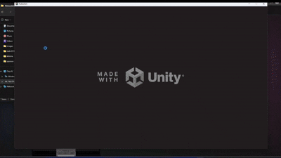

# 🎮 Football Sim

**A fun, little arcade football game with online P2P, local versus, and single-player modes.**
****


## <a name="about-the-project"></a>ℹ️ About The Project

Welcome to **Football Sim**! This game is a senior project which is developed by 2 students **Yunus Emre Aslan** and **Onur Özdemir**. Our main goal wasn't to create the next big esports title, but to build something we learn on the way.

It's a simple, fast-paced arcade football game that's all about quick fun. We wanted to make sure you could enjoy it in a few different ways:

* **Online P2P Multiplayer:** Challenge a friend to a match online! We integrated **Steamworks** to make connecting as easy as possible.

****
* **Local PvP:** The classic couch co-op experience. Perfect for some friendly rivalry.


****

* **Player vs. AI:** For solo players, we've programmed a surprisingly competent AI opponent using **Behavior Trees**. See if you can outsmart our little machine!

****

At its heart, this is just a simple, fun game. We learned a ton making it, and we hope you have as much fun playing it as we did building it.

---

## <a name="getting-started"></a>🚀 Getting Started

#### Prerequisites
This section will guide you on how to get started, whether you just want to play the game or explore the project code.
* **Unity Hub**
* **Unity Editor vith Version:** `6000.0.xx`

#### Installation

1.  Clone the repository:
    ```sh
    git clone https://github.com/Dubium0/FutbolSim.git
    ```
2.  Open the project in Unity Hub by clicking on `Add project from disk` and selecting the cloned repository's folder.
3.  Once the project is open in the Unity Editor, allow it to import all the necessary assets. This might take a few minutes.
4.  Open the main scene located at `Assets/Scenes/MainMenu.unity`.
5.  Press the **Play** button to start the game.

---

## <a name="how-to-play"></a>🔧 How to Play

Controls are very similiar to popular football games.

* **Keyboard Controls:**
    
    * `W`, `A`, `S`, `D`: Move the player.
    * `J`: Shoot.
    * `I`: Ground Pass.
    * `K`: Pass.
    * `L`: Lob Pass.

* **Controller Controls:**
    
    * `Left Stick`: Move the player.
    * `X`: Shoot.
    * `Y`: Ground Pass.
    * `A`: Pass.
    * `B`: Lob Pass.

* **Objective:** Win the game by scoring more goals in 3 minutes!
---

## <a name="technologies-used"></a>💻 Technologies Used

Detail the primary technologies and assets used in your project. This is crucial for anyone wanting to understand the technical aspects of your game.

* **Game Engine:** [Unity](https://unity.com/)
* **Programming Language:** [C#](https://docs.microsoft.com/en-us/dotnet/csharp/)

* **Key Unity Packages:**
    * `com.unity.inputsystem`
    * `com.unity.behavior`
    * `com.unity.netcode.gameobjects`
    * `com.community.netcode.transport.facepunch`

---


## <a name="license"></a>📄 License

Distributed under the GPL-3.0 License. See `LICENSE` for more information.

---

## <a name="acknowledgements"></a>🙏 Acknowledgements

* **Team Members**
    * [Yunus Emre Aslan](https://github.com/Dubium0) as developer.
    * [Onur Özdemir](https://github.com/OnurOzdemir0) as developer.
    * [Furkan Kıraç](https://github.com/furkankirac) as supervisor.

